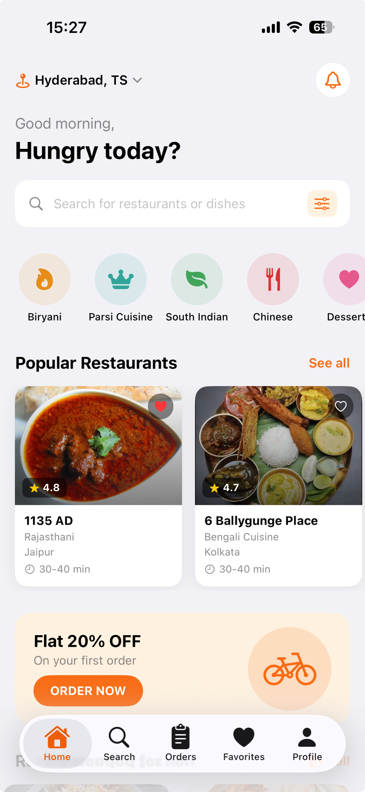
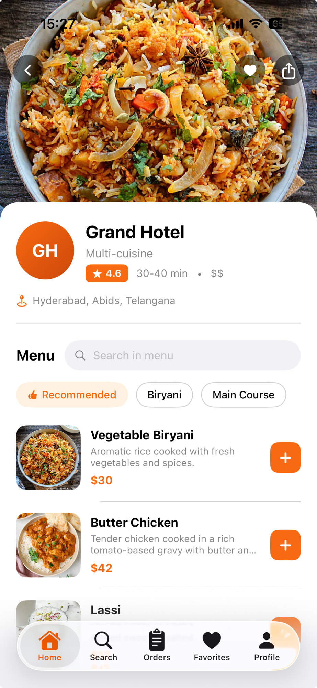
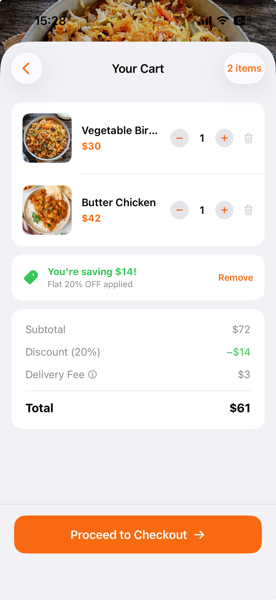
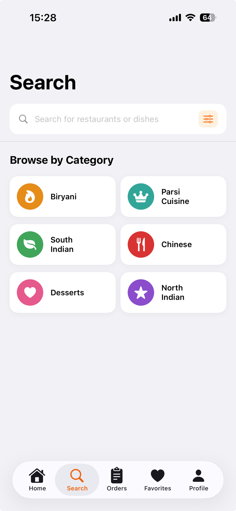
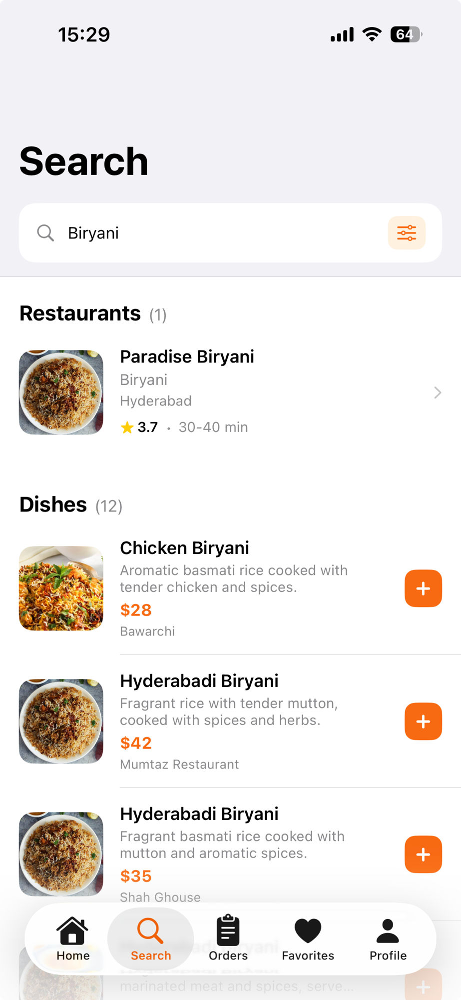
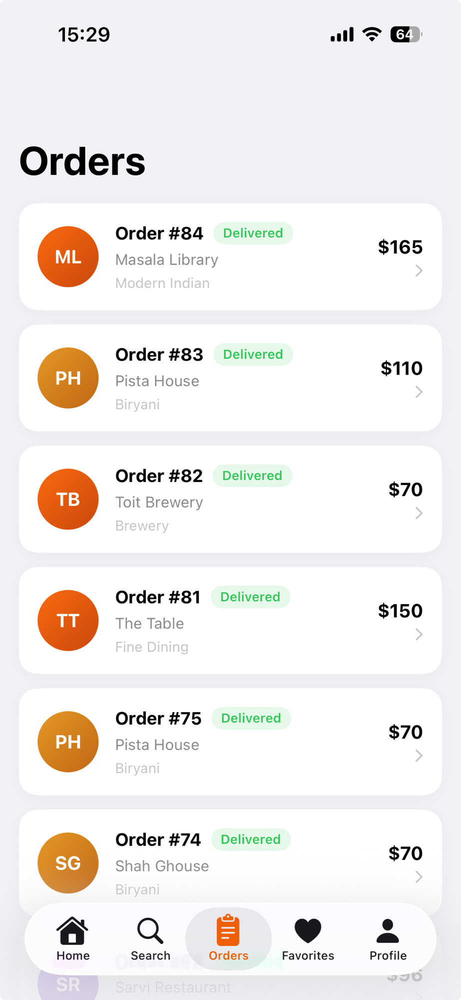
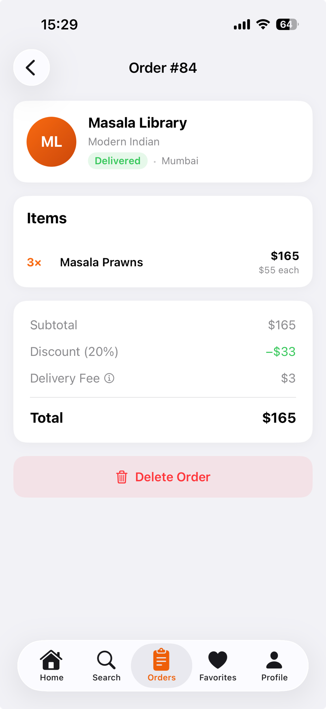
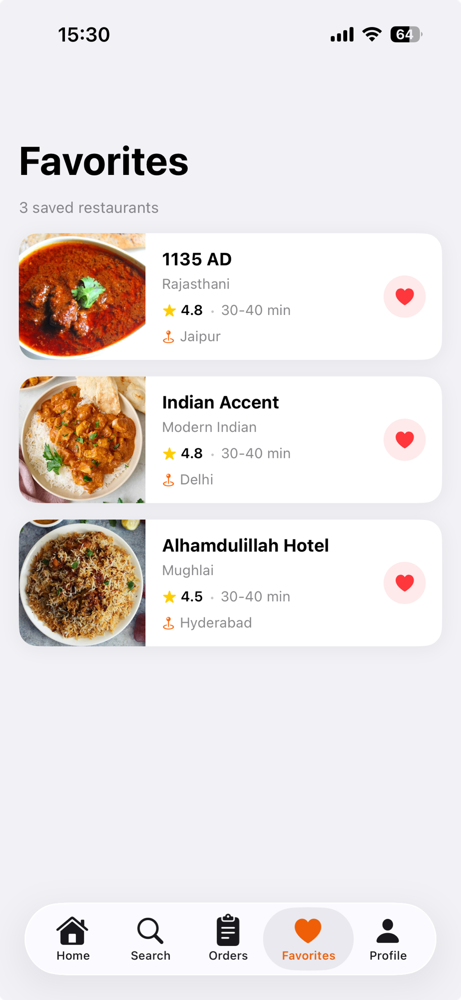
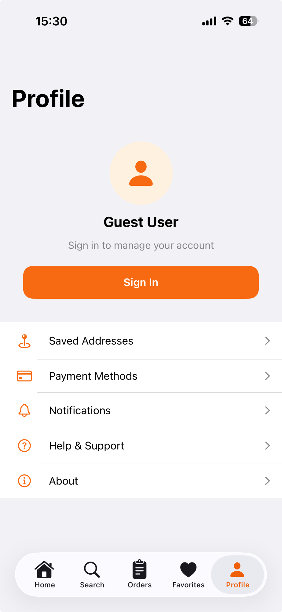

# Savory

A food delivery app for iOS. Browse restaurants, explore menus, save favorites, and track your orders.

## Screenshots

<table>
  <tr>
    <td></td>
    <td></td>
    <td></td>
  </tr>
  <tr>
    <td align="center">Home</td>
    <td align="center">Restaurant Detail</td>
    <td align="center">Cart</td>
  </tr>
  <tr>
    <td></td>
    <td></td>
    <td></td>
  </tr>
  <tr>
    <td align="center">Search</td>
    <td align="center">Search Results</td>
    <td align="center">Orders</td>
  </tr>
  <tr>
    <td></td>
    <td></td>
    <td></td>
  </tr>
  <tr>
    <td align="center">Order Detail</td>
    <td align="center">Favorites</td>
    <td align="center">Profile</td>
  </tr>
</table>

## Tech stack

| | |
|---|---|
| Language | Swift 5 (Xcode 26) |
| UI | SwiftUI |
| Minimum deployment | iOS 17 |
| State management | `@Observable` macro |
| Networking | `URLSession` async/await |
| Navigation | `NavigationStack` + `NavigationLink` |

## Architecture

MVVM. Full screens live in `pages/`, reusable components in `Views/`. Each screen with async data has a dedicated `@Observable` ViewModel.

**Skeleton loading** — every tab renders animated shimmer placeholders while data loads, replacing the blank-screen + spinner pattern.

**Parallax hero** — the restaurant detail screen reads scroll offset via `GeometryReader` and applies a fractional offset to the cover photo, so the white card slides over the image faster than the photo moves.

**Shared environment objects** — `CartManager` and `FavoritesManager` are `@Observable` classes injected at the root via `.environment()`, making cart and favorites state available to any view without prop drilling.

**Parallel fetching** — screens that need multiple data sources use `async let` to fire requests concurrently.

## Project structure

```
Savory/
  Models/       — Codable data models (Restaurant, MenuItem, MasterOrder, …)
  Services/     — APIService (one static method per endpoint)
  ViewModels/   — HomeViewModel, SearchViewModel, OrdersViewModel, CartManager, FavoritesManager
  Views/        — Reusable components and skeleton views
  pages/        — Full screens (HomeView, SearchView, RestaurantDetailView, CartView, …)
```

